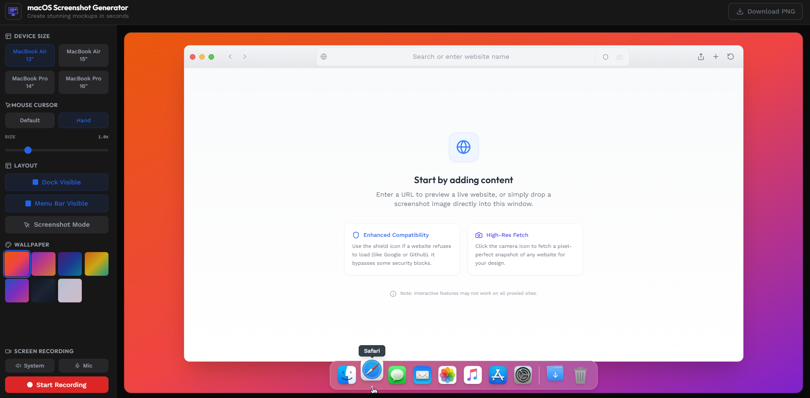
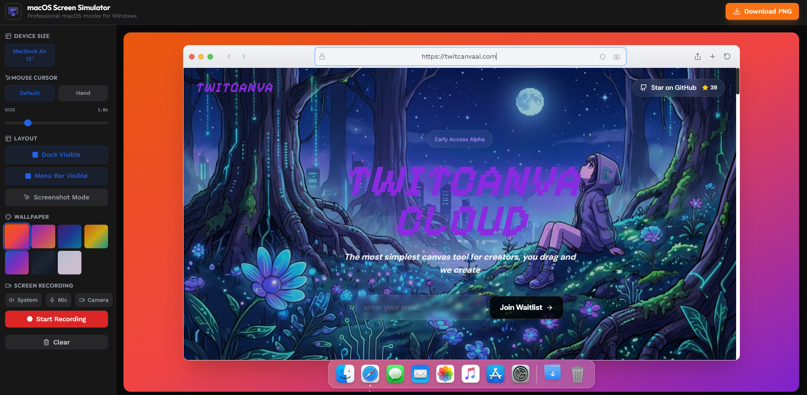

# macOS Screen Simulator 🍏

Generate stunning, professional macOS-style mockups and screenshots in seconds. Specifically designed for **Windows users** who want to showcase their websites or apps with that premium Apple aesthetic without needing a Mac.




## ✨ Features

- **Premium macOS UI**: A fully interactive macOS desktop environment with a functional Dock, Menu Bar, and Safari frame.
- **Dynamic Safari Window**: 
    - **URL Preview**: Enter any address to preview a live website.
    - **Proxy Support (Shield)**: Bypasses security headers (X-Frame-Options) for restricted sites like Google or GitHub.
    - **High-Res Fetch (Camera)**: Captures a pixel-perfect snapshot of any URL via the Microlink API.
- **Pro Workflow Integration**:
    - **Paste Support (Ctrl + V)**: Simply press `Shift + Win + S` in your browser, then click and paste directly into the mockup.
    - **Drag & Drop**: Drop any image file directly onto the Safari window.
- **Customizable Environment**:
    - **Wallpapers**: Choose from iconic macOS wallpapers (Sequoia, Sonoma, etc.).
    - **Device Models**: Optimized for **13" MacBook Air** proportions.
    - **Custom Cursors**: Select and scale macOS-style cursors (Pointer, Hand).
- **Pro Recording Suite**:
    - **4K Ultra HD**: High-bitrate (50 Mbps) recording at 3840px resolution.
    - **Webcam Overlay (PiP)**: Draggable circular camera bubble with zero-ghosting stability.
    - **Auto-Calibration**: Dynamic coordinate mapping that handles browser permission bars and layout shifts.
    - **Audio Mixing**: Record system/tab audio and microphone simultaneously.
    - **High-Res Export**: Download your final composition as a high-quality PNG.

## 🚀 Getting Started

### Prerequisites

- [Node.js](https://nodejs.org/) (Latest LTS recommended)
- [npm](https://www.npmjs.com/) or [yarn](https://yarnpkg.com/)

### Installation

1.  Clone the repository:
    ```bash
    git clone https://github.com/your-username/macos-screenshot-generator.git
    cd macos-screenshot-generator
    ```

2.  Install dependencies:
    ```bash
    npm install
    ```

3.  Start the development server:
    ```bash
    npm run dev
    ```

4.  Open your browser and navigate to `http://localhost:5173`.

## 🛠️ Tech Stack

- **Framework**: [React](https://reactjs.org/)
- **Build Tool**: [Vite](https://vitejs.dev/)
- **Styling**: [Tailwind CSS](https://tailwindcss.com/)
- **Icons**: [Lucide React](https://lucide.dev/)
- **Canvas Engine**: [Fabric.js](http://fabricjs.com/) & [html2canvas](https://html2canvas.hertzen.com/)

## 📄 License

This project is licensed under the MIT License - see the [LICENSE](LICENSE) file for details.

---

Built with ❤️ for the community. If you like this project, give it a ⭐️!
